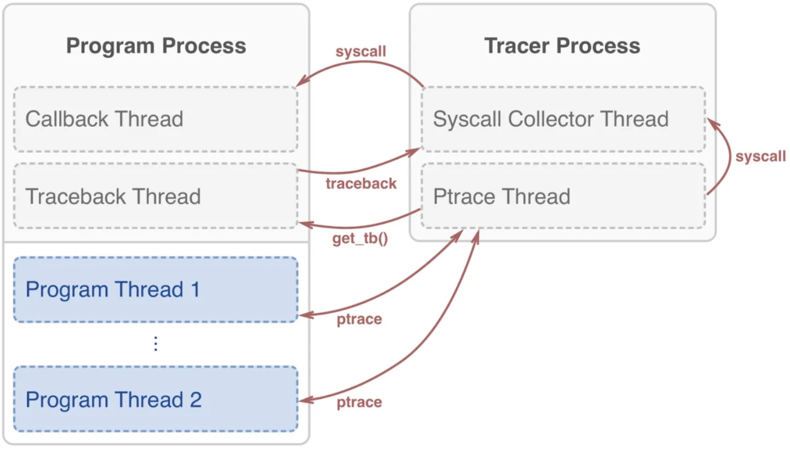

For a better understanding of Ptracer and the tutorial, we will explain how it traces the system calls behind the scenes by explaining its architecture, which is shown in the image below. 

Ptracer uses multiple threads to achieve the tracing in practice. To enable Ptracer, a ptracer-context has to be called, which spawns a thread responsible for the execution of the syscall callback, and another thread responsible for extracting a Python traceback from a given thread (left entity of the figure). In addition, it also spawns a subprocess which is responisble for the actual tracing of the syscalls (right entity of the figure). 

In practice, whenever the tracing subprocess detects a system call, the traceback thread is called to extract the call stack, and then adds it to the end of the queue. A callback is executed for all syscalls in the queue. If there is specified a filter, it checks if the syscall matches this before performing these steps. 
